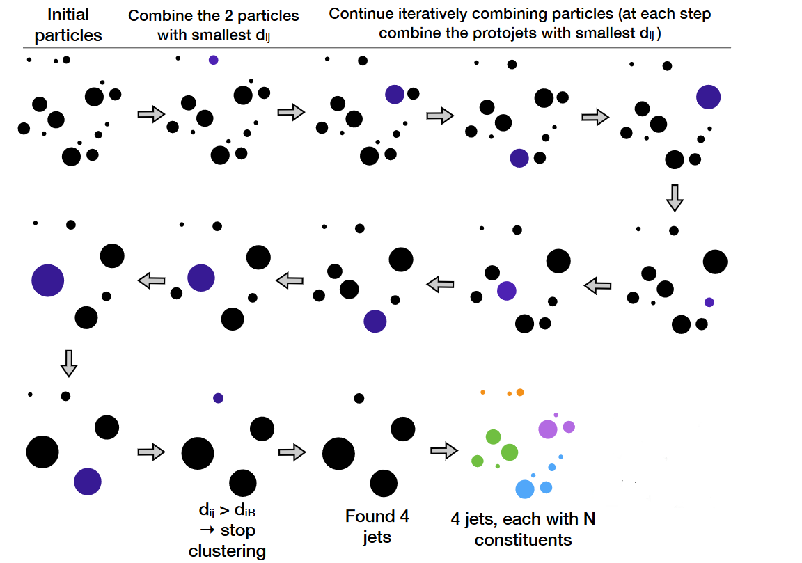

After tracks and energy deposits in the CMS tracking detectors (inner, muon) and calorimeters (electromagnetic, hadronic) are reconstructed as particle flow candidates, an event can be interpreted in various ways. Two common elements of event interpretation are **clustering jets** and calculating **missing transverse momentum**.

## Jets

Jets are spatially-grouped collections of long-lived particles that are produced when a quark or gluon hadronizes. The kinetmatic properties of
jets resemble that of the initial partons that produced them. In the CMS language, jets are made up of many particles, with the
following predictable energy composition:

*   ~65% charged hadrons
*   ~25% photons (from neutral pions)
*   ~10% neutral hadrons

Jets are very messy! Hadronization and the subsequent decays of unstable hadrons can produce 100s of particles near each other in the CMS detector.
Hence these particles are rarely analyzed individually. How can we determine which particle candidates should be included in each jet?

## Clustering

Jets can be clustered using a variety of different inputs from the CMS detector. "CaloJets" use only calorimeter energy deposits. "GenJets" use generated
particles from a simulation. But by far the most common are "PFJets", from **particle flow candidates**.

The result of the CMS Particle Flow algorithm is a list of particle candidates that account for all inner-tracker and muon tracks and all above-threshold
energy deposits in the calorimeters. These particles are formed into jets using a "clustering algorithm". The most common algorithm used by CMS is the
"anti-kt" algorithm, which is abbreviated "AK". It iterates over particle pairs and finds the two (*i* and *j*) that are the closest in some distance
measure and determines whether to combine them:

<a href="https://www.codecogs.com/eqnedit.php?latex=\text{Combine&space;when&space;}&space;d_{ij}&space;<&space;p^{-2}_{T,i}\text{&space;;&space;stop&space;when&space;}&space;d_{ij}&space;>&space;p^{-2}_{T,i}" target="_blank">&space;p^{-2}_{T,i}" title="\text{Combine when } d_{ij} < p^{-2}_{T,i}\text{ ; stop when } d_{ij} > p^{-2}_{T,i}" /></a>

The momentum power (-2) used by the anti-kt algorithm means that higher-momentum particles are clustered first. This leads to jets with a round shape that
tend to be centered on the hardest particle. In CMS software this clustering is implemented using the [[fastjet][www.fastjet.fr]] package. 

## Pileup

Inevitably, the list of particle flow candidates contains particles that did not originate from the primary interaction point. CMS experiences multiple
simultaneous collisions, called "pileup", during each "bunch crossing" of the LHC, so particles from multiple collisions coexist in the detector.
There are various methods to remove their contributions from jets:

 * Charged hadron subtraction [CHS](http://cms-results.web.cern.ch/cms-results/public-results/preliminary-results/JME-14-001/index.html): all charged hadron candidates 
 are associated with a track. If the track is not associated with the primary vertex, that
 charged hadron can be removed from the list. CHS is limited to the region of the detector covered by the inner tracker. The pileup contribution to
 neutral hadrons has to be removed mathematically -- more in episode 3!
 * PileUp Per Particle Identification (PUPPI, available in Run 2): CHS is applied, and then all remaining particles are weighted based on their likelihood of arising from
 pileup. This method is more stable and performant in high pileup scenarios such as the upcoming HL-LHC era.

## Accessing jets in CMS software

Jets software classes have the same basic 4-vector methods as the objects discussed in the previous lesson:

~~~
Handle<CaloJetCollection> jets;
iEvent.getByLabel(InputTag("ak5PFJets"), jets);

for (auto it = jets->begin(); it != jets->end(); it++) {

    value_jet_pt[value_jet_n] = it->pt();
    value_jet_eta[value_jet_n] = it->eta();
    value_jet_phi[value_jet_n] = it->phi();
    value_jet_mass[value_jet_n] = it->mass();

}
~~~
{: .language-cpp}

Particle-flow jets are not immune to noise in the detector, and jets used in analyses should be filtered to remove noise jets. 
CMS has defined a [Jet ID](http://cdsweb.cern.ch/record/1279362) with criteria for good jets: 

>The PFlow jets are required to have charged hadron fraction CHF > 0.0 if within tracking fiducial region of |eta| < 2.4, neutral hadron fraction NHF < 1.0, charged electromagnetic 
>(electron) fraction CEF < 1.0, and neutral electromagnetic (photon) fraction NEF < 1.0. These requirements remove fake jets arising from spurious energy depositions in a single 
>sub-detector. 
{: .quotation}

These criteria demonstrate how particle-flow jets combine information across subdetectors. Jets will typically have energy from electrons and photons, but those fractions of the total
energy should be less than one. Similarly, jets should have some energy from charged hadrons if they overlap the inner tracker, and all the energy should not come from neutral hadrons. 
A mixture of energy sources is expected for genuine jets. All of these energy fractions (and more) can be accessed from the jet objects. 

>## Challenge: Jet ID
>
>Use the [cms-sw github repository](https://github.com/cms-sw/cmssw/tree/CMSSW_5_3_X/DataFormats/JetReco/) to learn the methods available for PFJets 
>(hint: the header file is included from `AOD2NanoAOD.cc`). Implement the jet ID and **reject** jets that do not pass. Rejection means that information
>about these jets will not be stored in any of the tree branches.
>
>>## Solution
>>The header file we need is for particle-flow jets: `interface/PFJet.h` from the link given. It shows many functions like this:
>>~~~
>>float chargedHadronEnergyFraction () const {return chargedHadronEnergy () / energy ();}
>>~~~
>>{: .language-cpp}
>>These functions give the energy from a certain type of particle flow candidate as a fraction of the jet's total energy. We can apply the
>>conditions given to reject jets from noise at the same time we apply a momentum threshold:
>>~~~
>>for (auto it = jets->begin(); it != jets->end(); it++) {
>>  if (it->pt > jet_min_pt && it->chargedHadronEnergyFraction() > 0 && it->neutralHadronEnergyFraction() < 1.0 &&
>>      it->electronEnergyFraction() < 1.0 && it->photonEnergyFraction() < 1.0){
>>
>>    // calculate things on jets
>>  }
>>}
>>~~~
>>{: .language-cpp}
>{: .solution}
{: .challenge}

## MET

[Missing transverse momentum](https://cds.cern.ch/record/1543527) is the negative vector sum of the transverse momenta of all particle flow candidates in an event. 
The magnitude of the missing transverse momentum vector is called missing transverse energy and referred to with the acronym "MET". 
Since energy corrections are made to the particle flow jets, those corrections are propagated to MET by adding back the momentum vectors of the
original jets and then subtracting the momentum vectors of the corrected jets. This correction is called "Type 1" and is standard for all CMS analyses.
The jet energy corrections will be discussed more deeply at the end of this lesson.  

In `AOD2NanoAOD.cc` we open the particle flow MET module and extract the magnitude and angle of the MET, the sum of all energy
in the detector, and variables related to the "significance" of the MET. Note that MET quantities have a single value for the 
entire event, unlike the objects studied previously. 

~~~
Handle<PFMETCollection> met;
iEvent.getByLabel(InputTag("pfMet"), met);

value_met_pt = met->begin()->pt();
value_met_phi = met->begin()->phi();
value_met_sumet = met->begin()->sumEt();

value_met_significance = met->begin()->significance();
auto cov = met->begin()->getSignificanceMatrix();
value_met_covxx = cov[0][0];
value_met_covxy = cov[0][1];
value_met_covyy = cov[1][1];

~~~
{: .language-cpp}

MET significance can be a useful tool: it describes the likelihood that the MET arose from noise or mismeasurement in the detector
as opposed to a neutrino or similar non-interacting particle. The four-vectors of the other physics objects along with their 
uncertainties are required to compute the significance of the MET signature. MET that is directed nearly (anti)colinnear with 
a physics object is likely to arise from mismeasurement and should not have a large significance. 

>## Challenge: real and fake MET
>
>Compile all your changes to `AOD2NanoAOD.cc` so far and run over the simulation sample again. 
>This test file contains top quark pair events, so some events will have leptonic decays that include neutrinos
>and some events will not. Review TTree::Draw from the pre-exercises -- can you draw histograms of MET versus MET significance 
>and infer which events have leptonic decays? 
>
> ~~~
> $ scram b
> $ cmsRun configs/simulation_cfg.py
> $ # edit simulation_cfg.py to use the Drell-Yan test file, and save output_DY.root
> $ cmsRun confings/simulation_cfg.py
> $ root -l output.root
> [0] TTree *ttbar = (TTree*)_file0->Get("aod2nanoaod/Events");
> [1] TFile *_file1 = TFile::Open("output_DY.root");
> [2] TTree *dy = (TTree*)_file1->Get("aod2nanoaod/Events");
> [3] ttbar->Draw("...things...","...any cuts...","norm)
> [4] dy->Draw("...things...","...any cuts...","norm pe same")
> ~~~
> {: .language-bash}
>
>>## Solution
>>
>>The difference between the Drell-Yan events with primarily fake MET and the top pair events with primarily genuine MET
>>can be seen by drawing `MET_pt` or by drawing `MET_significance`. In both distributions the Drell-Yan events have 
>>smaller values than the top pair events.
>>
>> 
>{: .solution}
{: .challenge}



