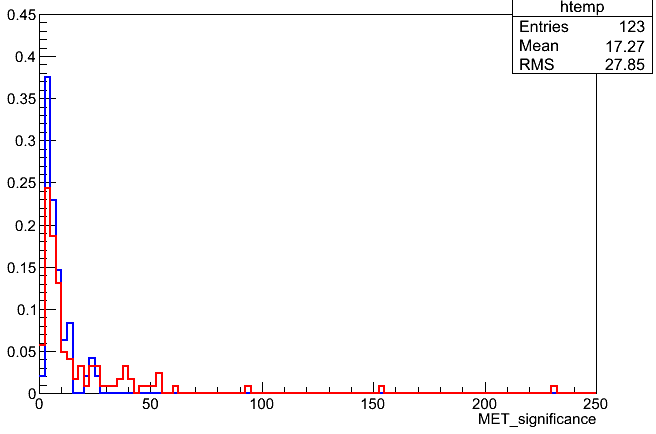

>## Challenge: alternate IDs and isolations
>
>Using the documentation on the TWiki page, adjust the 0.4-cone muon isolation calculation
>to apply the "DeltaBeta" pileup correction.
>Also add the pass/fail information about the Loose and Soft identification working points.
>> ## Solution:
>> The DeltaBeta correction for pileup involves subtracting off half of the pileup contribution
>> that can be accessed from the "iso04" object already being used:
>>~~~
>>value_mu_pfreliso04all[value_mu_n] =
>>    (iso04.sumChargedHadronPt + max(0.,iso04.sumNeutralHadronEt + iso04.sumPhotonEt- 0.5*iso04.sumPUPt))/it->pt();
>>~~~
>>{: .language-cpp}
>>
>> To add new ID variables we follow the same sequence as other challenges: declaration, branch, access. 
>> You might add these beneath the existing "Tight" ID in all three places:
>>~~~
>>bool value_mu_tightid[max_mu];
>>bool value_mu_softid[max_mu];
>>bool value_mu_looseid[max_mu];
>>~~~
>>{: .language-cpp}
>>~~~
>>tree->Branch("Muon_tightId", value_mu_tightid, "Muon_tightId[nMuon]/O");
>>tree->Branch("Muon_softId", value_mu_softid, "Muon_softId[nMuon]/O");
>>tree->Branch("Muon_looseId", value_mu_looseid, "Muon_looseId[nMuon]/O");
>>~~~
>>{: .language-cpp}
>>~~~
>>value_mu_tightid[value_mu_n] = muon::isTightMuon(*it, *vertices->begin());
>>value_mu_softid[value_mu_n] = muon::isSoftMuon(*it, *vertices->begin());
>>value_mu_looseid[value_mu_n] = muon::isLooseMuon(*it);
>>~~~
>>{: .language-cpp}
>>
>> The TWiki also gives the member functions needed to reconstruct the muon ID. We can see from the built-in tightID method that a 
>> vertex is needed for some of the criteria: `muon::isTightMuon(*it, *vertices->begin())`. To see how to interact with the
>> vertex collection you can refer back to the vertex section starting at line 504 (according to the file in the github repository). 
>> ~~~
>> value_mu_isTightByHand[value_mu_n] = false;
>> if( it->isGlobalMuon() && it->isPFMuon() && 
>>     it->globalTrack()->normalizedChi2() < 10. && it->globalTrack()->hitPattern().numberOfValidMuonHits() > 0 &&
>>     it->numberOfMatchedStations() > 1 && 
>>     fabs(it->muonBestTrack()->dxy(vertices->begin()->position())) < 0.2 && fabs(it->muonBestTrack()->dz(vertex->position())) < 0.5 &&
>>     it->innerTrack()->hitPattern().numberOfValidPixelHits() > 0 && it->innerTrack()->hitPattern().trackerLayersWithMeasurement() > 5)
>>    {
>>      value_mu_isTightByHand[value_mu_n] = true;
>>    }
>> ~~~
>>{: .language-cpp}

>## Challenge: alternate tau IDs
>
>Many other tau discriminants exist. Based on information from the TWiki, 
>save the values for some discriminants that are based on rejecting electrons or muons.
>
>> ## Solution:
>> The TWiki describes Loose/Medium/Tight ID levels for an "AntiElectron" algorithm and an "AntiMuon" algorithm. 
>> They can be accessed like the other tau IDs, but you might need to refer to the output of `edmDumpEventContent` 
>> to find the exact form of the InputTag name. 
>>
>> Add declarations:
>>~~~
>>bool value_tau_idantieleloose[max_tau];
>>bool value_tau_idantielemedium[max_tau];
>>bool value_tau_idantieletight[max_tau];
>>bool value_tau_idantimuloose[max_tau];
>>bool value_tau_idantimumedium[max_tau];
>>bool value_tau_idantimutight[max_tau];
>>~~~
>>{: .language-cpp}
>> Add branches:
>>~~~
>>tree->Branch("Tau_idAntiEleLoose", value_tau_idantieleloose, "Tau_idAntiEleLoose[nTau]/O");
>>tree->Branch("Tau_idAntiEleMedium", value_tau_idantielemedium, "Tau_idAntiEleMedium[nTau]/O");
>>tree->Branch("Tau_idAntiEleTight", value_tau_idantieletight, "Tau_idAntiEleTight[nTau]/O");
>>tree->Branch("Tau_idAntiMuLoose", value_tau_idantimuloose, "Tau_idAntiMuLoose[nTau]/O");
>>tree->Branch("Tau_idAntiMuMedium", value_tau_idantimumedium, "Tau_idAntiMuMedium[nTau]/O");
>>tree->Branch("Tau_idAntiMuTight", value_tau_idantimutight, "Tau_idAntiMuTight[nTau]/O");
>>~~~
>>{: .language-cpp}
>> Create handles and get the information from the input file:
>>~~~
>>Handle<PFTauCollection> taus;
>>iEvent.getByLabel(InputTag("hpsPFTauProducer"), taus);
>>
>>Handle<PFTauDiscriminator> tausLooseIso, tausVLooseIso, tausMediumIso, tausTightIso,
>>                           tausDecayMode, tausLooseEleRej, tausMediumEleRej,
>>                           tausTightEleRej, tausLooseMuonRej, tausMediumMuonRej,
>>                           tausTightMuonRej, tausRawIso;
>>
>> // new things only
>>iEvent.getByLabel(InputTag("hpsPFTauDiscriminationByLooseElectronRejection"),
>>        tausLooseEleRej);
>>iEvent.getByLabel(InputTag("hpsPFTauDiscriminationByMediumElectronRejection"),
>>        tausMediumEleRej);
>>iEvent.getByLabel(InputTag("hpsPFTauDiscriminationByTightElectronRejection"),
>>        tausTightEleRej);
>>
>>iEvent.getByLabel(InputTag("hpsPFTauDiscriminationByLooseMuonRejection"),
>>        tausLooseMuonRej);
>>iEvent.getByLabel(InputTag("hpsPFTauDiscriminationByMediumMuonRejection"),
>>        tausMediumMuonRej);
>>iEvent.getByLabel(InputTag("hpsPFTauDiscriminationByTightMuonRejection"),
>>        tausTightMuonRej);
>>~~~
>>{: .language-cpp}
>> And finally, access the discriminator from the second element of the pair:
>>~~~
>>value_tau_idantieleloose[value_tau_n] = tausLooseEleRej->operator.second;
>>value_tau_idantielemedium[value_tau_n] = tausMediumEleRej->operator.second;
>>value_tau_idantieletight[value_tau_n] = tausTightEleRej->operator.second;
>>value_tau_idantimuloose[value_tau_n] = tausLooseMuonRej->operator.second;
>>value_tau_idantimumedium[value_tau_n] = tausMediumMuonRej->operator.second;
>>value_tau_idantimutight[value_tau_n] = tausTightMuonRej->operator.second;
>>~~~
>>{: .language-cpp}
>{: .solution}
{: .challenge}

>## Challenge: Jet ID
>
>Use the [cms-sw github repository](https://github.com/cms-sw/cmssw/tree/CMSSW_5_3_X/DataFormats/JetReco/) to learn the methods available for PFJets 
>(hint: the header file is included from `AOD2NanoAOD.cc`). Implement the jet ID and **reject** jets that do not pass. Rejection means that information
>about these jets will not be stored in any of the tree branches.
>
>>## Solution
>>The header file we need is for particle-flow jets: `interface/PFJet.h` from the link given. It shows many functions like this:
>>~~~
>>float chargedHadronEnergyFraction () const {return chargedHadronEnergy () / energy ();}
>>~~~
>>{: .language-cpp}
>>These functions give the energy from a certain type of particle flow candidate as a fraction of the jet's total energy. We can apply the
>>conditions given to reject jets from noise at the same time we apply a momentum threshold:
>>~~~
>>for (auto it = jets->begin(); it != jets->end(); it++) {
>>  if (it->pt > jet_min_pt && it->chargedHadronEnergyFraction() > 0 && it->neutralHadronEnergyFraction() < 1.0 &&
>>      it->electronEnergyFraction() < 1.0 && it->photonEnergyFraction() < 1.0){
>>
>>    // calculate things on jets
>>  }
>>}
>>~~~
>>{: .language-cpp}
>{: .solution}
{: .challenge}

>## Challenge: real and fake MET
>
>Compile all your changes to `AOD2NanoAOD.cc` so far and run over the simulation sample again. 
>This test file contains top quark pair events, so some events will have leptonic decays that include neutrinos
>and some events will not. Review TTree::Draw from the pre-exercises -- can you draw histograms of MET versus MET significance 
>and infer which events have leptonic decays? 
>
> ~~~
> $ scram b
> $ cmsRun configs/simulation_cfg.py
> $ # edit simulation_cfg.py to use the Drell-Yan test file, and save output_DY.root
> $ cmsRun confings/simulation_cfg.py
> $ root -l output.root
> [0] TTree *ttbar = (TTree*)_file0->Get("aod2nanoaod/Events");
> [1] TFile *_file1 = TFile::Open("output_DY.root");
> [2] TTree *dy = (TTree*)_file1->Get("aod2nanoaod/Events");
> [3] ttbar->Draw("...things...","...any cuts...","norm)
> [4] dy->Draw("...things...","...any cuts...","norm pe same")
> ~~~
> {: .language-bash}
>
>>## Solution
>>
>>The difference between the Drell-Yan events with primarily fake MET and the top pair events with primarily genuine MET
>>can be seen by drawing `MET_pt` or by drawing `MET_significance`. In both distributions the Drell-Yan events have 
>>smaller values than the top pair events.
>>
>> 
>{: .solution}
{: .challenge}
