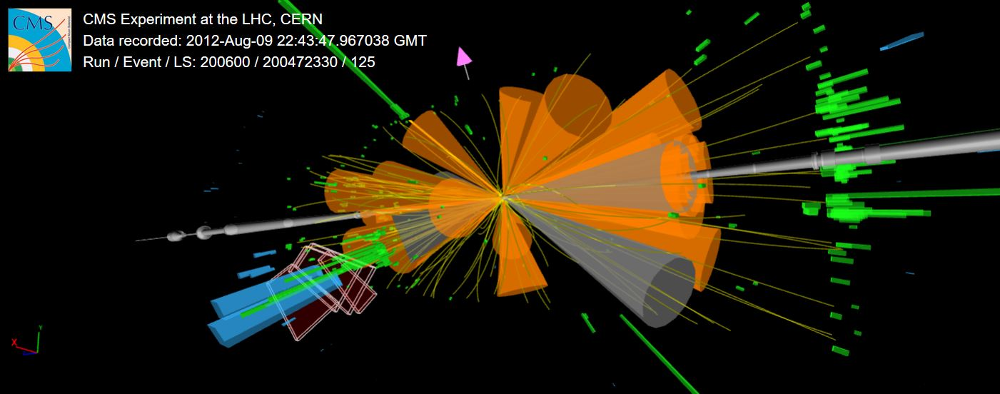

> ## What is this lesson about?
>
> Welcome.  In this lesson you will:
>
> - Learn about the PhysObjectExtractorTool (POET) code framework.
> - Learn how electrons, photons, muons, taus, jets, missing energy, and triggers are stored using POET.
> - Practice running POET and investigating the physics object ROOT trees.
> - Learn how to build a complete analysis selection using these physics objects. 
{: .objectives}

> ## Prerequisites
>
> Work through the **Pre-exercises**:
>  * [VM](https://cms-opendata-workshop.github.io/workshop2021-lesson-virtualmachine/} or [Docker](https://cms-opendata-workshop.github.io/workshop2021-lesson-docker/)
>  * [ROOT](https://cms-opendata-workshop.github.io/workshop2021-lesson-preexercise-cpp-and-root/)
>  * [Intro to Physics Objects](https://cms-opendata-workshop.github.io/workshop2021-lesson-introphysicsobjects/)
>  * [CMSSW](https://cms-opendata-workshop.github.io/workshop2021-lesson-cmssw/)
>  * [Trigger](https://cms-opendata-workshop.github.io/workshop2021-lesson-introtrigger/)
>
> Then follow the instructions in the **Setup page** below.
{: .prereq}

> ## Helpline
>
> Remember that we are always available to help.  Our [Mattermost][mattermost] channel is open.
{: .callout}


